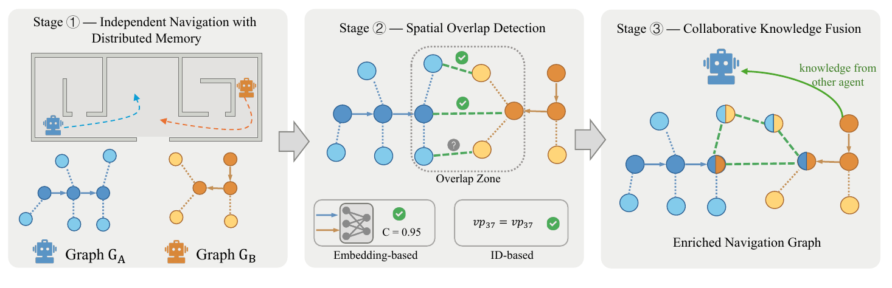

# Co-VLN: Vision-Sharing Collaboration for Vision-Language Navigation

Official code for **Does Peer Observation Help? Vision-Sharing Collaboration for Vision-Language Navigation** (ACCV 2026).
[[arXiv]](https://arxiv.org/abs/2603.20804) [[Project Page]](https://qunchaojin.github.io/CoVLN/)

Qunchao Jin, Yiliao Song, Qi Wu

<p align="center">
  
</p>

## Setup

1. Install the Matterport3D simulator following [this guide](https://github.com/peteanderson80/Matterport3DSimulator) (latest version, not v0.1), then

```bash
export PYTHONPATH=/path/to/Matterport3DSimulator/build:$PYTHONPATH
```

2. Create the environment

```bash
conda create -n covln python=3.10
conda activate covln
pip install -r requirements.txt
```

## Data

Follow the data preparation steps of [MapGPT](https://github.com/chen-judge/MapGPT#setup): R2R annotations and connectivity graphs go under `datasets/R2R/annotations` and `datasets/R2R/connectivity`, and the pre-rendered observation images (`RGB_Observations`) are passed via `--img_root`.

## MLLM API

The agent talks to any OpenAI-compatible chat endpoint. Set your key as an environment variable, never in code:

```bash
cp .env.example .env   # fill in OPENAI_API_KEY, optionally OPENAI_BASE_URL
set -a; source .env; set +a
```

Results in the paper use `Qwen3-VL-32B-Instruct` by default; pass any other model name via `--llm`.

## Run

```bash
bash scripts/run_r2r.sh
```

Key arguments (see `vln/parser.py`):

| Argument | Meaning |
| --- | --- |
| `--pairing {prior,random}` | how episodes within a scan are paired into concurrent agents. `prior` maximises ground-truth path overlap (main setting), `random` pairs at random |
| `--split` | `val_unseen` (full R2R val unseen, 2349 episodes) or `MapGPT_72_scenes_processed` (216-episode subset) |
| `--start / --end` | run only a slice of the pairs, e.g. `--end 5` for a smoke test |
| `--llm` | model name sent to the endpoint |
| `--img_root` | root of the pre-rendered observation images |

Each run writes to `--output_dir`:

- `preds/case_InstrID_*.json` and `preds/case_aux_InstrID_*.json`: trajectory and metrics of the main / aux agent of each pair
- `logs/process.txt`: every prompt, shared image indices, and raw model output
- `logs/valid.txt`: aggregate metrics over all episodes

## Evaluate

```bash
python tools/aggregate_results.py --pred_dir datasets/exprs_map/<exp>/preds --output <exp>.xlsx
```

prints SR / SPL / OSR / NE averaged over all episodes and per agent role, and saves the per-episode table.

## Citation

```bibtex
@article{jin2026covln_arxiv,
  title={Does Peer Observation Help? Vision-Sharing Collaboration for Vision-Language Navigation},
  author={Jin, Qunchao and Song, Yiliao and Wu, Qi},
  journal={arXiv preprint arXiv:2603.20804},
  year={2026}
}
```

or

```bibtex
@inproceedings{jin2026covln,
  title={Does Peer Observation Help? Vision-Sharing Collaboration for Vision-Language Navigation},
  author={Jin, Qunchao and Song, Yiliao and Wu, Qi},
  booktitle={Asian Conference on Computer Vision (ACCV)},
  year={2026}
}
```

## Acknowledgement

This codebase is built on [MapGPT](https://github.com/chen-judge/MapGPT). Thanks to the authors for releasing their code.

## Contact

qunchao.jin@adelaide.edu.au
